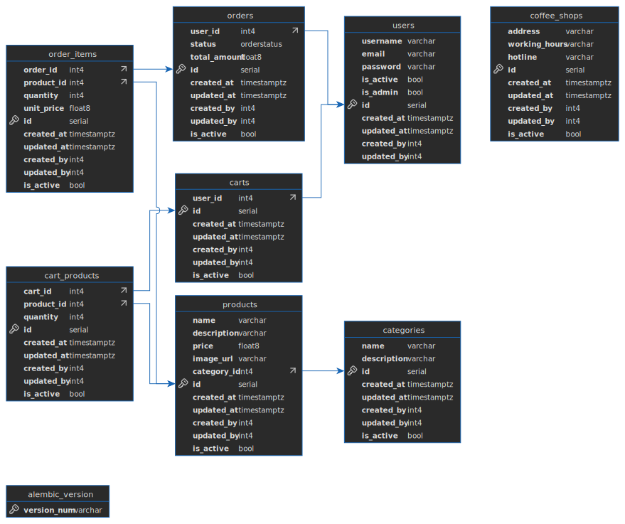

# Coffee shop API 🚚💰


## 📄 Table of Contents
- [Coffee shop API 🚚💰](#coffee-shop-api-)
  - [📄 Table of Contents](#-table-of-contents)
  - [🎯 Overview](#-overview)
  - [✨ Key Features and Highlights](#-key-features-and-highlights)
  - [🔧 Technologies Used](#-technologies-used)
  - [🏛 Architecture Overview](#-architecture-overview)
  - [🚀 Running the Application](#-running-the-application)
    - [Prerequisites](#prerequisites)
    - [Steps](#steps)
  - [📝 Project Structure](#-project-structure)
  - [👷🏻‍♂ Design Patterns](#-design-patterns)
    - [Design Patterns](#design-patterns)
  - [📈 Performance and Scalability](#-performance-and-scalability)
  - [📚 Documentation](#-documentation)
  - [📬 Contact Information](#-contact-information)

## 🎯 Overview

The **Coffee shop API** is a backend service designed for a coffee shop, which further must be integrated with fronted.

## ✨ Key Features and Highlights

- **Modular Architecture 🗂️:** Clean MVC structure promoting maintainability.
<!-- - **SOLID Principles 🎯:** Strong adherence, especially in Dependency Injection. -->
- **Design Patterns 🧩:** Strategic use of Singleton, and Observer patterns.
- **SOLID Principles 🧩** : Tried my best to follow
- **Asynchronous Programming ⚡:** Enhances performance and scalability.
- **Background Tasks 🕒:** Non-blocking logging operations.
- **Flexible Logging System 📜🖥️:** Observer pattern for configurable log destinations.
- **Dynamic Configuration Management 🛠️:** Environment variables and `pydantic-settings`.
- **Clean Input Validation ✅:** Effective and robust validation.
- **Comprehensive Documentation 📚:** High-quality inline and external documentation.

## 🔧 Technologies Used

- **Programming Language:** Python 3.12+
- **Frameworks & Libraries:** FastAPI, Pydantic, SQLalchemy, PostgreSQL, Celery, Redis, JWT Authentication, Docker
- **Tools:** Github
- **Design Patterns:** Singleton, Observer


## 🏛 Architecture Overview

The Coffe shop API follows a modular MVC architecture, separating concerns across different layers:

- **Routers:** Define API endpoints and handle request routing.
- **Models:** Define Pydantic models for request validation and response schemas.
- **Services:** Contain business logic for CRUD operations.
- **Repositories:** Serves for communication with database using SQLalchemy.
- **Middlewares:** Manage cross-cutting concerns like logging and error handling.
- **Utils:** Provide utility classes and strategies for distance calculation and pricing.
- **Exceptions:** Define custom exceptions and their handlers for consistent error responses.

## 🚀 Running the Application

### Prerequisites

- **Docker**: Ensure docker is installed. You can download it from the [official website](https://www.python.org/downloads/).
- **Git**: To clone the repository.

### Steps

1. **Clone the Repository**
    ```bash
    git clone https://github.com/ArataKido/coffee_shop.git # or unzip the file you downloaded
    cd coffee_shop
    ```

2. **Setup environmental variables**
    ```
    Copy templates from .env.template.example, create .env.template file and set up your own credentials for SMTP connection
    ```

3. **Run containers**
    ```bash
    make build
    make up
    ```
    or

    ```bash
    docker compose build --no-cache
    docker compose up -d
    ```

5. **Optional: Populate database**
    ```bash
    make populate
    or
    run the SQL code from sql/test_data.sql
    ```

6. **Optional: More command instructions**
    ```bash
    make help
    ```

## 📝 Project Structure

```plaintext
```

## 👷🏻‍♂ Design Patterns 

### Design Patterns

- **Singleton Pattern:** Applied to the `Logger` to ensure a single instance throughout the application, optimizing resource usage and maintaining consistent state.
- **Observer Pattern:** Implemented in the `Logger` to flexibly add or remove log destinations based on environment variables, enhancing the logging system's configurability.


## 📈 Performance and Scalability
- **Asynchronous Operations ⚡:**
  - Leverages asynchronous programming paradigms throughout the application to handle multiple requests efficiently.
  - Enhances throughput and reduces latency, making the service scalable under high load.
  
- **Thread-Safe Implementations 🧵:**
  - Ensures thread safety in singleton implementations using locks, preventing race conditions and ensuring consistent behavior.
  
- **Efficient Resource Management 🔄:**
  - Uses context managers and graceful shutdown procedures to manage resources effectively, preventing memory leaks and dangling connections.

## 📚 Documentation

- **Inline Code Documentation 📖:**
  - Docstrings and comments throughout the codebase provide clear explanations of classes and methods.
  - Facilitates easier onboarding for new contributors and streamlines maintenance processes.

- **API Documentation 📝:**
  - Automatically generated interactive API docs available at `localhost:8000/redoc` and `/docs`
  - Includes detailed schemas, parameter descriptions, and example requests/responses.
- **ER Diagram 📚**
  - 
- **Further Improvements**
  - [Suggested improvements](docs/improvements.md)

## 📬 Contact Information

- **Shahzod Ravshanov**
- **Email:** [shahzod.rav@gmail.com](mailto:shahzod.rav@gmail.com)
- **Telegram:** [@ArataKido](https://t.me/aratakido)
- **GitHub:** [github.com/ArataKido](https://github.com/ArataKido)
